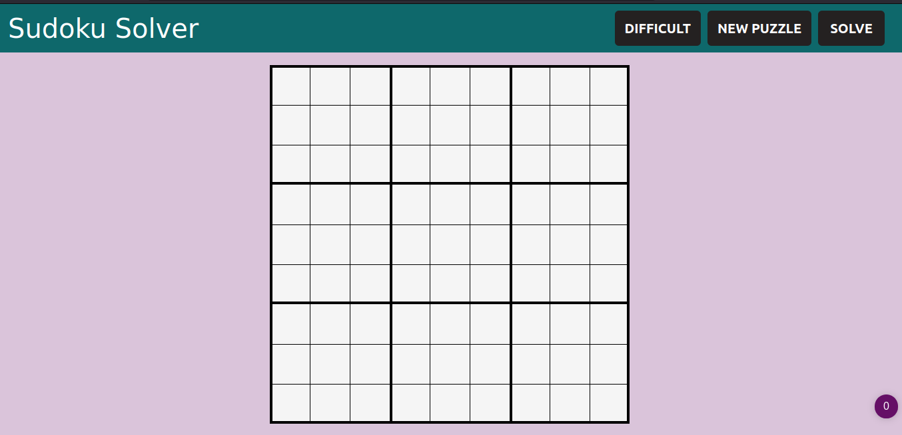
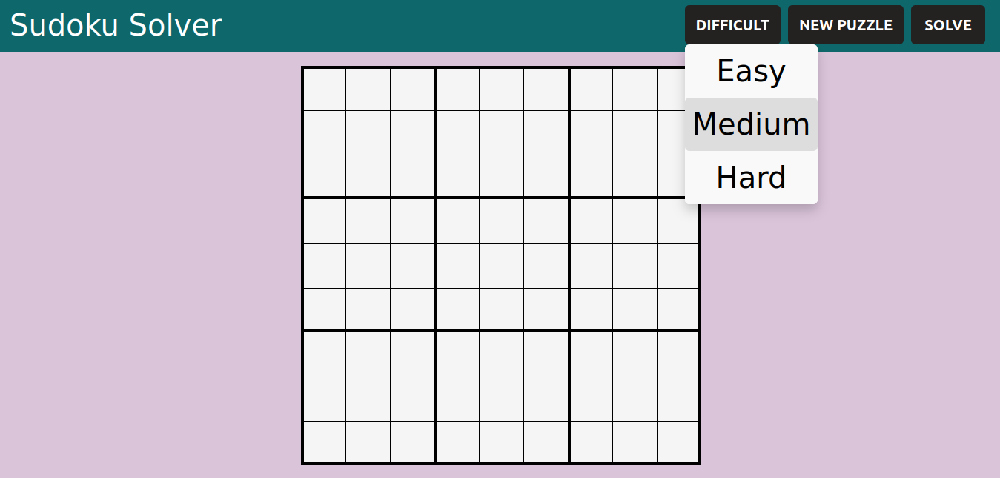
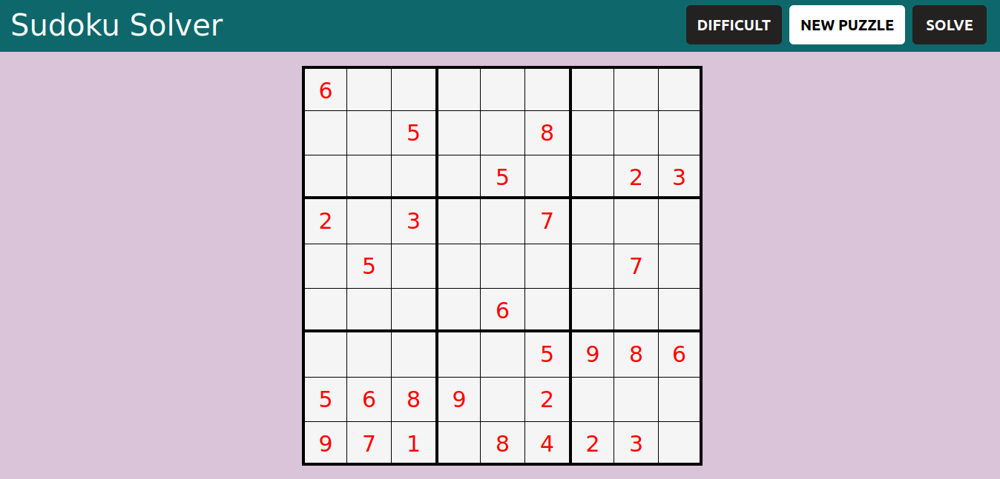
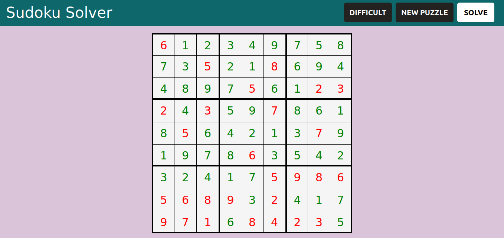

# Backtracking_Sudoku_Solver

### Screenshots:

| 1 | 2 |
 :-------------------------:  |  :-------------------------:
 | 
| 3 | 4 |
 | 

## Algorithm Used

* **Backtracking**

## Built With

* [HTML5](https://devdocs.io/html/)
* [CSS3](https://devdocs.io/css/)
* [JavaScript](https://devdocs.io/javascript/)

## Authors

* **Khageshwor Joshi** - [Orion](https://github.com/khageshwor)

## Contributions of any kind  are welcome!

    - Leave a pull request!!! and dont forget to give a star.
